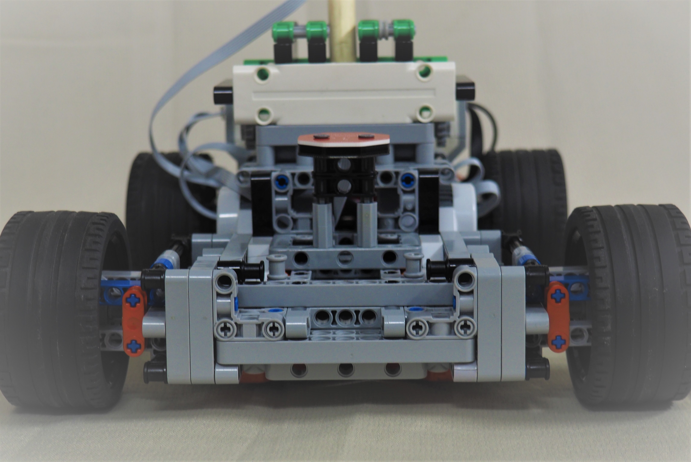

# **Personal/HS Projects** ⌨️

There's so much to talk about! Let's dive right in... 😎

> Projects conducted with Cisco Research will be added in soon as a separate page! 

## **Developing Reinforcement-Learning Traffic Control** 🚦

> Fast Facts: Synopsys Science Fair 2017, 2018 - AI Traffic Light System

My partner and I worked on developing a Deep Q-Network Reinforcement Learning model to control traffic lights intelligently. After interviewing the director of San Jose’s Department of Transportation, we received access to realtime data from several traffic intersections. We utilized the Simulation of Urban Mobility (SUMO) and TensorFlow to create a model that demonstrated a 26% reduction in average commute time. Using an embedded processor and LED strips to represent roads, we built a prototype to visualize our findings.

**Notable Distinctions**:

* **First Place**, Physical Science and Engineering Category, Synopsys Science Fair 2019
* Invited to and honored at **San Jose City Hall**, 2020

[Project Poster](https://drive.google.com/file/d/193Z7hajYU1kOT84vDRewygERVCS3HKD8/view?usp=sharing){ .md-button .md-button--secondary } [GitHub Repo](https://github.com/AdvitDeepak/aitc){ .md-button .md-button--secondary } [Project Abstract](https://drive.google.com/file/d/1ZdCpK8lK6STjGfe6FR-ZTcPamCqyLi13/view?usp=sharing){ .md-button .md-button--secondary }

??? tip "Media Montage - Developing Reinforcement-Learning Traffic Control"

    

    <iframe src=../assets/AiTC_Poster.pdf width="100%" height="800"></iframe>
    

&nbsp; &nbsp;

## **Using ToF for Touchless Computer Interaction** 📸

> Fast Facts: Synopsys Science Fair 2019, 2020 - Depth-Camera for Keyboard/Mouse

My partner and I developed a time-of-flight-based touchless Human Interface Device (HID). Using a CamBoard Pico Flexx Time-of-flight sensor, our HID allows for mouse control and typing simply by the movement of one’s hand in the air. The ToF camera feeds 3D distance maps to a processing pipeline comprising OpenCV and Machine Learning. This pipeline performs modelling and recognition of gestures and handwriting. This innovation will make device usage less restrictive and more hygienic by eliminating the need for physical contact.

**Notable Distinctions**:

* Awarded **ACM Grand Prize Award**, Synopsys Science Fair 2020
* Expanded and presented as **BISV Senior Project** (in colab w/ OpenARK)
* Filed a **Utility Patent** for several innovations in HID

[Project Poster](https://drive.google.com/file/d/1l9-BXNJM0YwgzXQzeGcyRXMGN5fDN39W/view?usp=sharing){ .md-button .md-button--secondary } [Demo](https://www.youtube.com/watch?v=GBEofB6hBao){ .md-button .md-button--secondary } [Skit](https://www.youtube.com/watch?v=MoZ89S_JGR8){ .md-button .md-button--secondary } [Blog](https://siliconvalley.basisindependent.com/author/advitd/){ .md-button .md-button--secondary } [Github Repo](https://github.com/AdvitDeepak/toffi){ .md-button .md-button--secondary }

??? danger "Media Montage - Using ToF Sensor for Touchless Computer Interaction"

    

    <iframe src=../assets/Toffi_Poster.pdf width="100%" height="800"></iframe>

    <iframe width="100%" height="425px" src="https://www.youtube.com/embed/GBEofB6hBao" frameborder="0" allow="accelerometer; autoplay; encrypted-media; gyroscope; picture-in-picture" allowfullscreen></iframe>
    

&nbsp; &nbsp;

## **Creating singAlong Tool** 🎤

> Fast Facts: Final project of *Capstone: Advanced Java + ML*, accelerated w/ TigerGraph

This program allows users to play any song from any timestamp simply by singing the previous verse. For example, if I were to sing *“Up above the world so high”*, the program would automatically play Twinkle Twinkle Little Star starting from the line *“Like a diamond in the sky”*. This program is meant to be a fun game for any user and provides social company even if a user is currently by themselves. Anyone can use it to easily start playing a song from any given timestamp instead of just from the beginning. Additionally, if a user may not remember the name of a song, they can use this program to find its name.

I later accelerated this program using TigerGraph. Fun fact, *that's how I landed my internship!*

[Original Demo](https://www.youtube.com/watch?v=2gfME-rsNc4){ .md-button .md-button--secondary } [Demo w/ TG](https://www.youtube.com/watch?v=K9zHRc9GmeU){ .md-button .md-button--secondary } [GitHub Repo](https://github.com/AdvitDeepak/singAlong-TG){ .md-button .md-button--secondary } [Slides](https://drive.google.com/file/d/11Hd-apZU5_-oy_cCbo-Cowyz-H_Qw--9/view?usp=sharing){ .md-button .md-button--secondary }

??? info "Media Montage - singAlong"

    

    <iframe width="100%" height="425px" src="https://www.youtube.com/embed/2gfME-rsNc4" frameborder="0" allow="accelerometer; autoplay; encrypted-media; gyroscope; picture-in-picture" allowfullscreen></iframe>
    <iframe width="100%" height="425px" src="https://www.youtube.com/embed/K9zHRc9GmeU" frameborder="0" allow="accelerometer; autoplay; encrypted-media; gyroscope; picture-in-picture" allowfullscreen></iframe>
    

&nbsp; &nbsp;

&nbsp; &nbsp;

## **Constructing Self-Balancing Inverted Pendulum** 🔨

> Fast Facts: Semester project for *Post-AP Differential Equations*, 11th grade

When asked to demonstrate an application of differential equations, I built a motorized cart with a freely swinging rod mounted on top. Using the rod’s angular acceleration, I programmed a PID controller using the derived equations of motion to calculate the horizontal acceleration needed to balance the rod. As a result, the cart autonomously moved back and forth to make sure the rod remained stable in the vertical position.

[Medium Blog](https://advit-deepak.medium.com/making-an-inverted-pendulum-using-lego-mindstorms-ev3-63352d51e556){ .md-button .md-button--secondary } [Instagram Post](https://www.instagram.com/p/B6BXxbkAaTi/){ .md-button .md-button--secondary }  [Submitted Report](https://drive.google.com/file/d/1AmACbuyZ1xjMYiSSFvcjXnmvZDveN7_B/view?usp=sharing){ .md-button .md-button--secondary }

??? abstract "Media Montage - Constructing Self-Balancing Inverted Pendulum"

    

    
    
    
    

&nbsp; &nbsp;

## **Modeling Romantic Relationships with Diff Eqs** 💕

A friend and I studied a research paper about dynamically modelling love. Using systems of first-order equations, we defined individuals’ love as a function of their feelings, their partner's feelings, and external factors. We classified lovers into four categories and analyzed all the possible combinations of individuals. By creating a phase plane plot, we were able to predict the duration and strength of each relationship.

[Desmos Plot](https://www.desmos.com/calculator/bhotlondc4){ .md-button .md-button--secondary } [Project Slides](https://drive.google.com/file/d/1TvBVSlamCDmlbykeU1E9kg8S-r7u7EYl/view?usp=sharing){ .md-button .md-button--secondary }

> *In the Desmos Plot below, a represents external factors, r represents time, and the name of each trace represents the natures of the couple. For example, C-E means Cautious and Eager while N-H means Narcissistic and Hermit. More can be found in the slides.*

??? danger "Media Montage - Modeling Romantic Relationships with Diff Eqs"

    

    <iframe width=100% height=800 src=https://www.desmos.com/calculator/bhotlondc4></iframe>
    

&nbsp; &nbsp;
