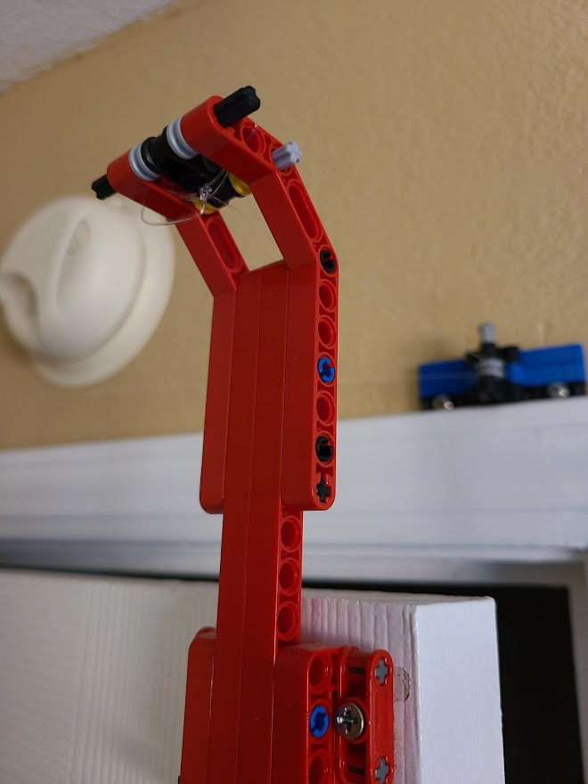
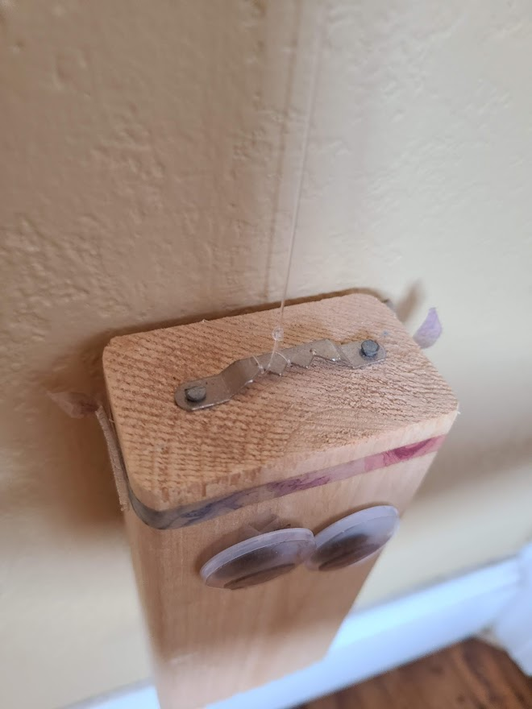
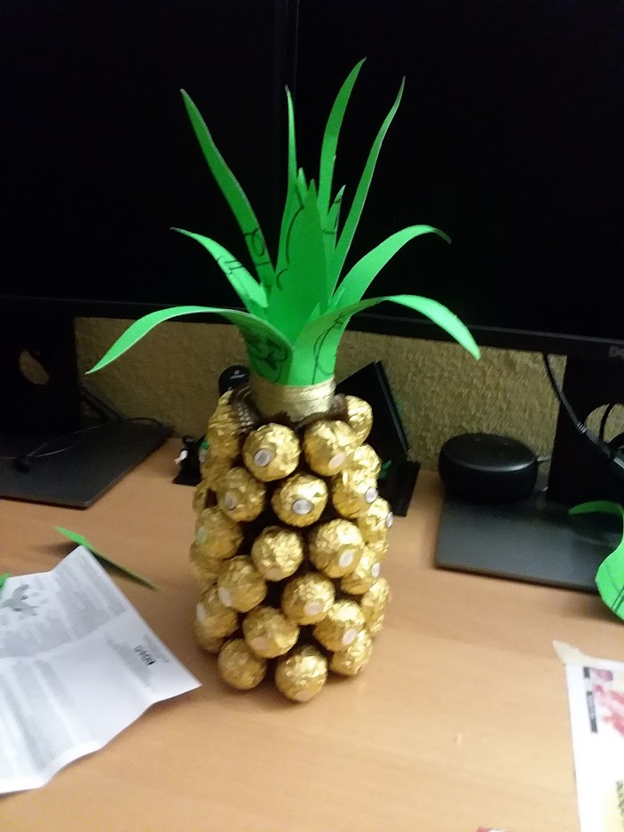
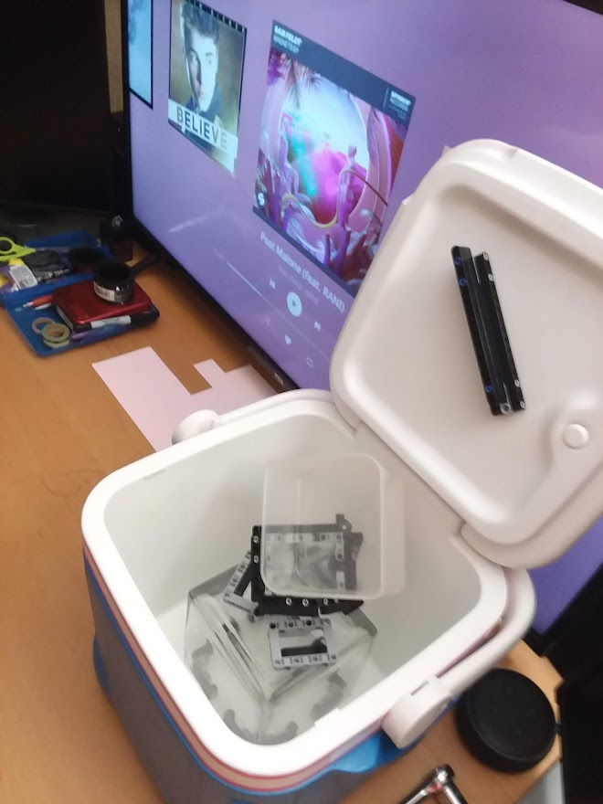
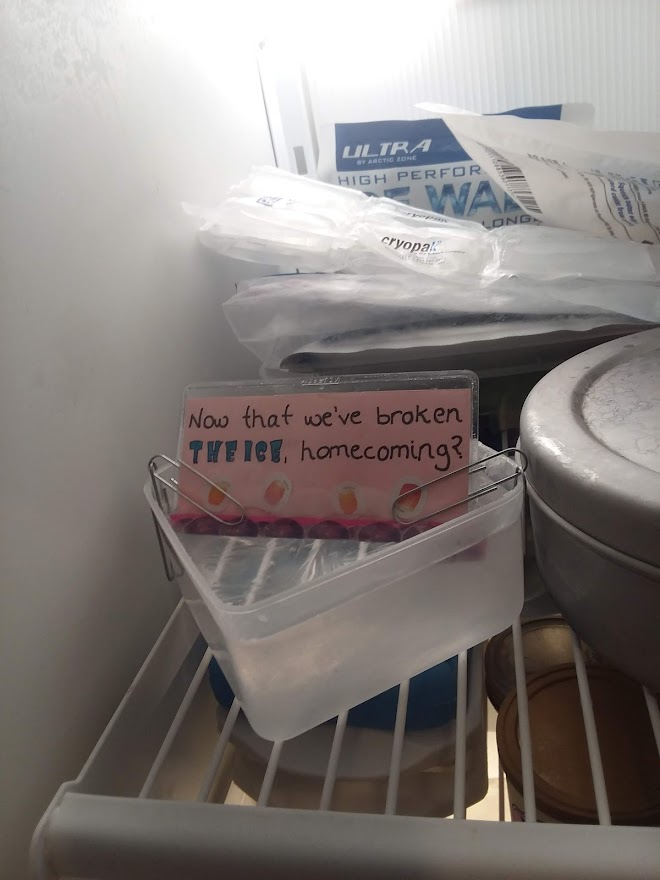
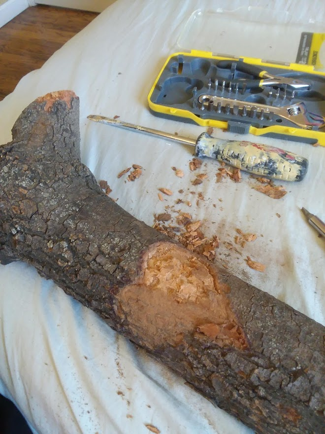
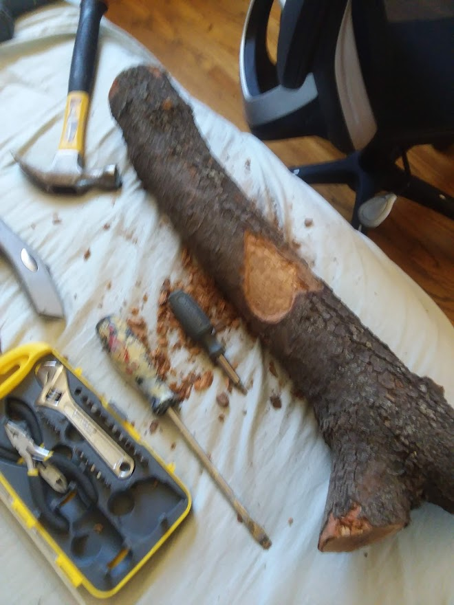
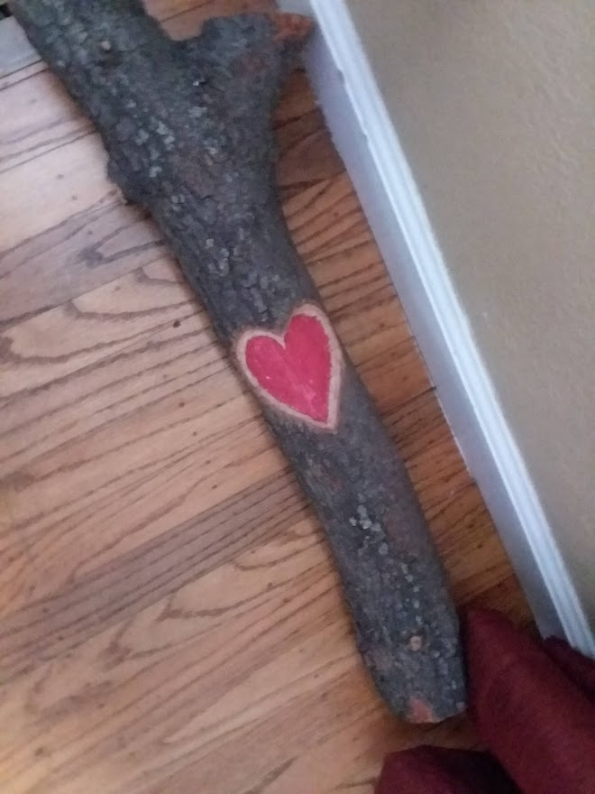
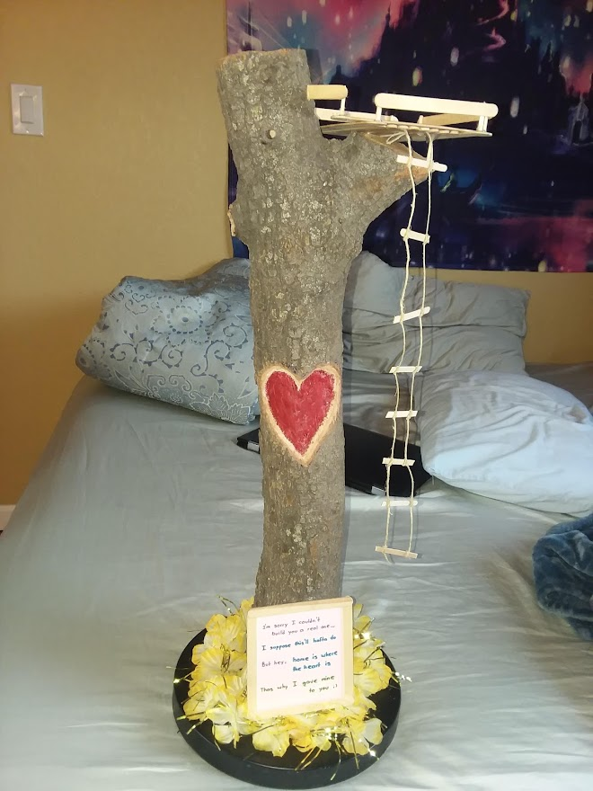
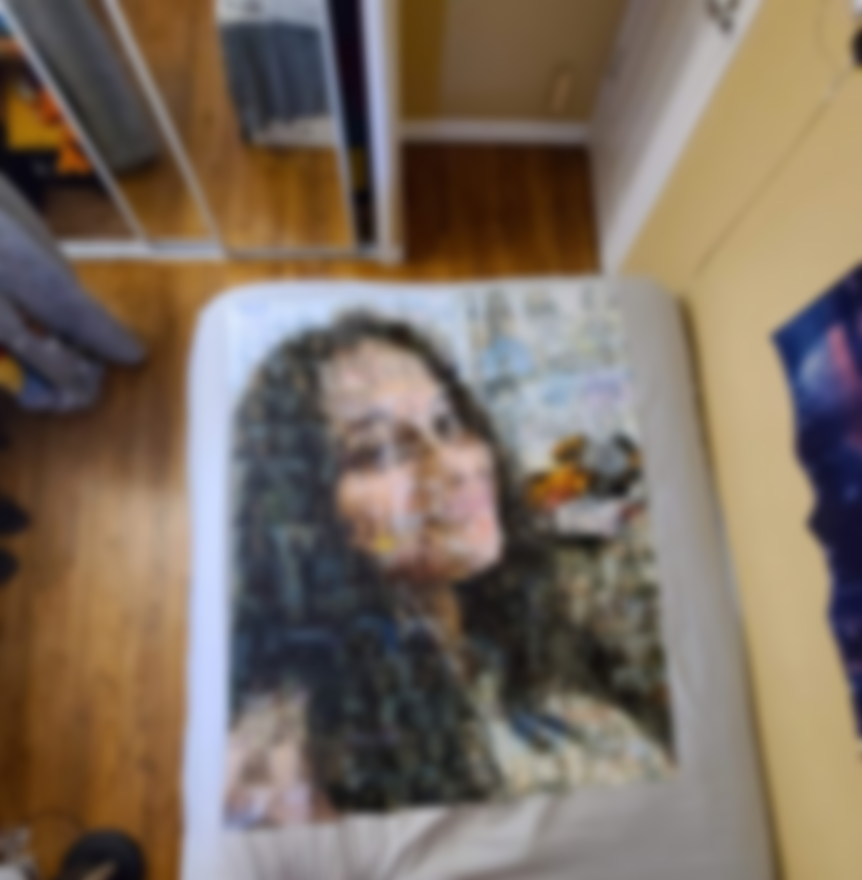

# **Misc/DIY Projects**

## **FIRST Lego League** ⚙️

FIRST Lego League (FLL) is a competition where teams build and program a Lego robot to solve missions (robot game) and brainstorm a solution to each year’s themed challenge (project). For five years, I participated in FLL, learning about engineering, teamwork, and problem-solving. Our team grew and adapted to overcome challenges. We won several awards and even travelled to Missouri and West Virginia to participate in the internationals.

Upon aging out of competition, I helped coach my brother's team. I taught engineering concepts (for example, using gravity as an extra “motor”), helped them learn to work together, and gave them  feedback on their research project. Additionally, my former team and I presented at community STEM nights and advised local FLL teams with tips & tricks.

### **TrashTrek - TrashApp** 🗑️

> Fast Facts: 2014-2015 Competition Season, focused on improving/reducing Trash

[Article](https://www.times-standard.com/2016/02/11/san-jose-team-of-almaden-middle-schoolers-to-compete-in-the-olympics-for-robots/){ .md-button .md-button--secondary } [Newspaper Cover](https://drive.google.com/file/d/1oAWWeyNU0ykc4ss1cazXiRdYxqAh1a2w/view?usp=sharing){ .md-button .md-button--secondary } [Robot Game](https://www.youtube.com/watch?v=-t_9EL6hdks){ .md-button .md-button--secondary } [Slides](https://drive.google.com/file/d/1kiaOAMnsBDTXYJ2mziQ6DqvyYcsdMIB8/view?usp=sharing){ .md-button .md-button--secondary }

### **Animal Allies - AnimalApp** 🐶

> Fast Facts: 2015-2016 Competition Season, focused on improving lives of Animals and Pets

[Robot Game](https://www.youtube.com/watch?v=toFJO8uPQAM){ .md-button .md-button--secondary } [Slides](https://drive.google.com/file/d/1Fhi7ov2pzfd2IW2Btf5UYUdNaYXuva0p/view?usp=sharing){ .md-button .md-button--secondary } [Official TechMagic (Our Team!) Site](https://flltechmagic.wixsite.com/6952){ .md-button .md-button--secondary }

&nbsp; &nbsp;

## **Personal Projects** 😮

Here are some of the personal creations I've made in my free time!

### **Automatic Door Closer** 🔧

> Fast Facts: Gravity-powered door closing device using LEGOs and pulleys

At home, my mischievous younger brother would purposely leave my door open 🙄. So, using Legos, fishing line, and a small wooden weight, I defended my room by designing and installing a pulley system that would automatically close my door. The door swinging open pulled the weight up. When the handle was released, gravity pulled the weight down, thereby closing my door. It was inexpensive, inconspicuous, and green (no electricity needed!).

[Medium Blog](https://advit-deepak.medium.com/making-a-fully-automatic-gravity-powered-door-closer-a28445c3e763){ .md-button .md-button--secondary } [Building Instructions](https://advit-deepak.medium.com/building-instructions-for-gravity-powered-door-closer-57e517182729){ .md-button .md-button--secondary } [Project Writeup](https://drive.google.com/file/d/1fslQ4Xt8TqX58xqO80U8mVJRjjedSx4X/view?usp=sharing){ .md-button .md-button--secondary }

??? bug "Media Montage - Automatic Door Closer"

    

    

    
    

&nbsp; &nbsp;

### **Presents/Surprises** 🎁

> Fast Facts: A collection of miscellaneous D-I-Y projects that I put together

* **Ferrero-Rocher Pineapple** - Made w/ Ferrero-Rochers and a Starbucks Drink

??? info "Sneak Peek - Ferrero-Rocher Pineapple"

    

    
    

* **Now that we've broken the ice?** - An ice-block with a note frozen inside

??? info "Sneak Peek - Broken the Ice"

    

    
    
    

* **Engraved Treehouse** - Popsicle sticks, chiesels, and tree branches

??? info "Sneak Peek - Engraved Treehouse"

    

    
    
    
    
    

* **Photo Mosaic** - Small 4X6s coming together to make wall-sized image

??? info "Sneak Peek - Photo Mosaic"

    

      **The following images have been blurred for privacy purposes!**

    
    
    

&nbsp; &nbsp;
