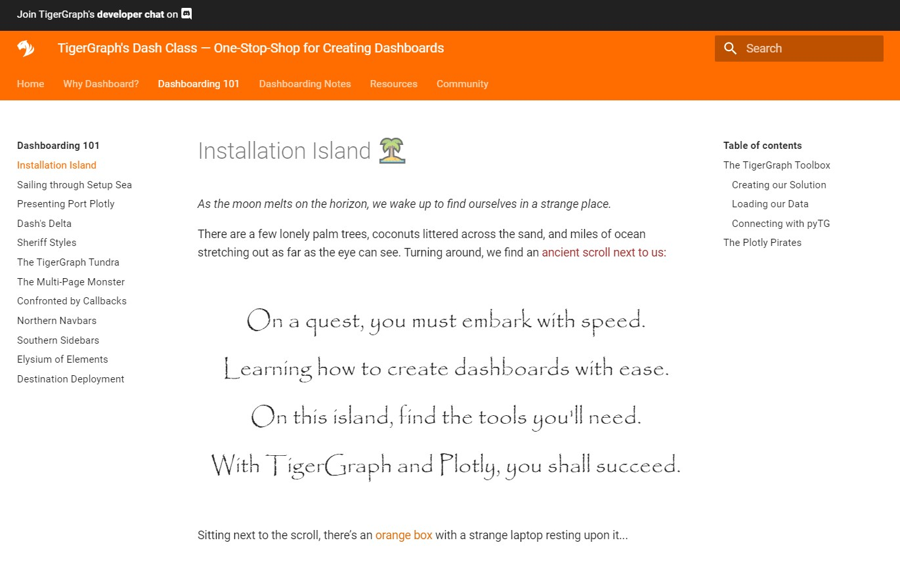
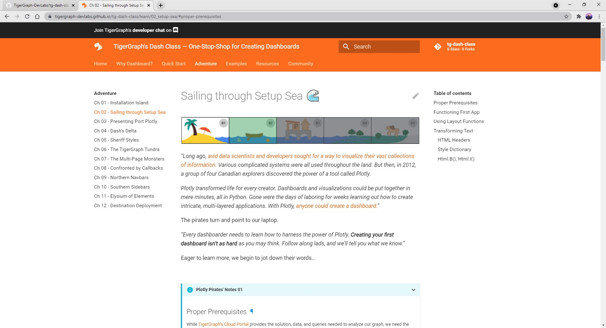
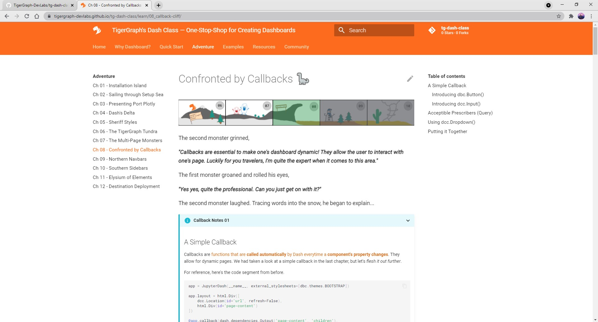
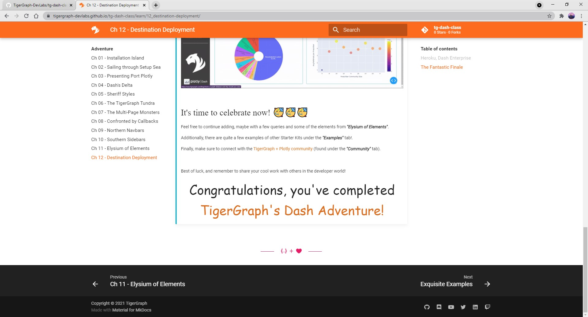
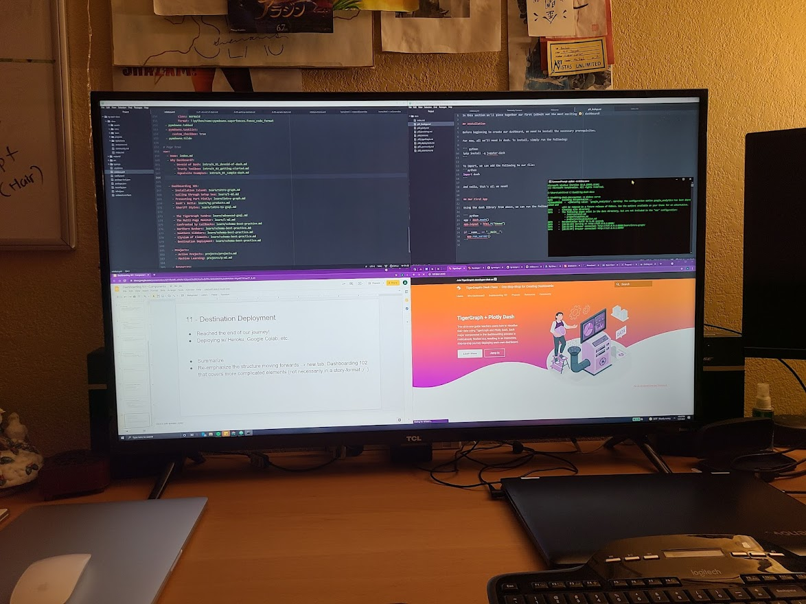
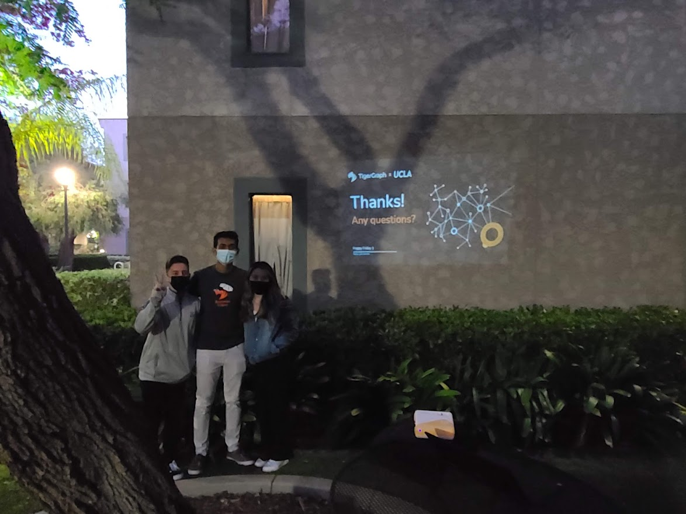
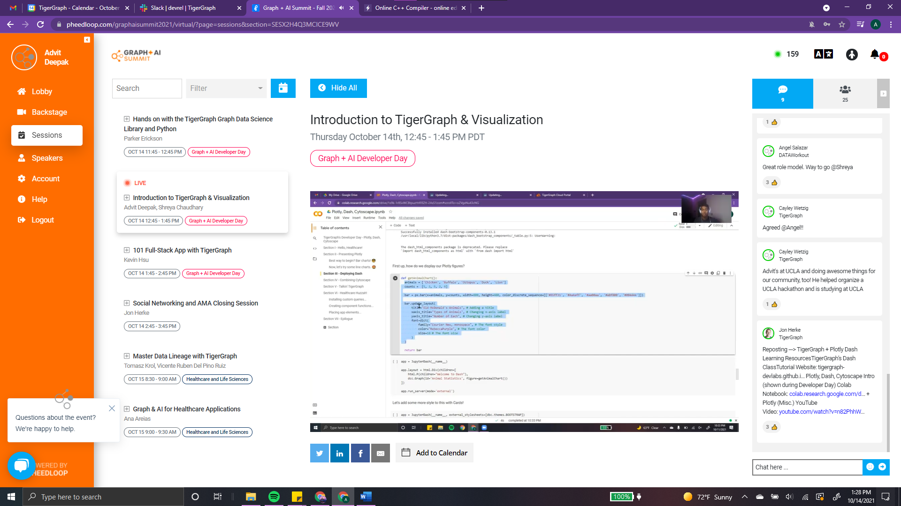
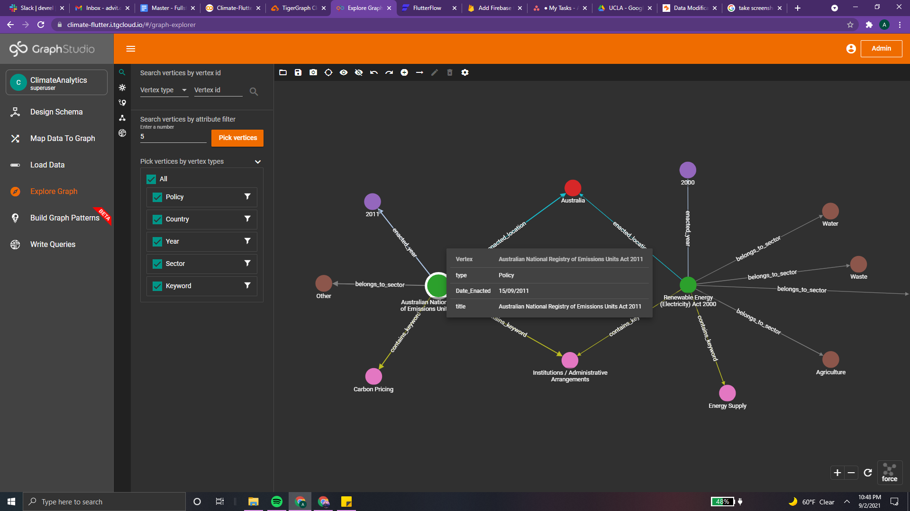

# **TigerGraph Projects** 🐯

Here's what I completed during my time at TigerGraph!

## **Visualizing Movie Recommendations** 📹

A movie dashboard for TigerGraph's Starter Kit, made using Plotly Dash.

[YouTube Demo](https://www.youtube.com/watch?v=wHUr3NLw_wg){ .md-button .md-button--secondary } [Colab Notebook](https://colab.research.google.com/drive/1eF7SY_2D9ynAEHjmU3xjOLI7xWSR7FH0?usp=sharing){ .md-button .md-button--secondary } [Medium Blog](https://advit-deepak.medium.com/visualizing-movie-recommendations-using-plotly-and-tigergraph-4052eae27d82){ .md-button .md-button--secondary }

??? tip "Media Montage - Visualizing Movie Recommendations"

    

    

    

    
    

## **TigerGraph's Dash Class** 📚

A twelve-chapter guide to putting together one's dashboard using TigerGraph and Plotly Dash. An interactive
*adventure* teaching users to create their own Healthcare Dashboard.

[Live Website](https://tigergraph-devlabs.github.io/tg-dash-class/){ .md-button .md-button--secondary } [Colab Notebook](https://colab.research.google.com/drive/1RRirZeUi_zSBEDS9lDJw1dsxth_V0f-9#scrollTo=6DlebXT4DMCf){ .md-button .md-button--secondary } [YouTube Demo](https://youtu.be/V7p1QnAmojk?t=1645){ .md-button .md-button--secondary }

??? note "Media Montage - TigerGraph's Dash Class"

    

    

    

    

    
    

## **Misc - Fullstack, UCLA Hackathon, Developer Day** 📂

Helped create Fullstack Course (credit @ Kevin Hsu), organized a UCLA X TigerGraph Hackathon, and
presented at Developer Day Conference explaining how to visualize Graph.

[Fullstack Course](https://hhsu99.github.io/tg-fullstack-course/){ .md-button .md-button--secondary } [UCLA X TG Hackathon](https://www.eventbrite.com/e/ucla-hackathon-with-tigergraph-and-plotly-tickets-168660535201){ .md-button .md-button--secondary } [Dev Day](https://youtu.be/V7p1QnAmojk){ .md-button .md-button--secondary }

??? info "Media Montage - Misc TigerGraph Work"

    

    

    

    

    

## **TG's Student Dev Program** 🍎

Launching TigerGraph's Student Developer Program, enabling high school and college students globally to learn, develop, and share
the power of Graph technology.

Although it's still a work in progress, here's a [Linktree](https://linktr.ee/TigerGraphStudents) and [Overview Website](https://advitdeepak.github.io/tg-student-dev/).

## **Climate Analysis/Prediction** 📈

Analyzing legislation's impact on climate change, specifically emissions and energy usage. How
would new legislation affect emissions in different regions based on historical data?

??? info "Media Montage - Climate Analysis/Prediction"

    

    
    

## **NLP for Transcript Analysis** 🔎

This program extracts insights from Zoom transcripts using NLTK. Analyses run include sentiment, topics, and a knowledge graph representing the interactions among speakers.

[GitHub Repo](https://github.com/AdvitDeepak/transcript-analysis){ .md-button .md-button--secondary } [YouTube Demo](https://www.youtube.com/watch?v=8v3k_1K4B_Y){ .md-button .md-button--secondary } [Sample Transcript](https://github.com/AdvitDeepak/transcript-analysis/blob/master/a_raw_transcripts/sample01.vtt){ .md-button .md-button--secondary }

&nbsp; &nbsp;
