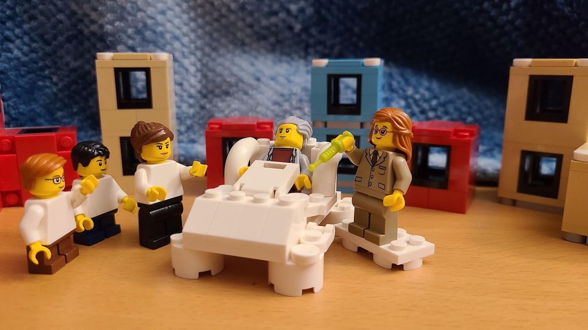
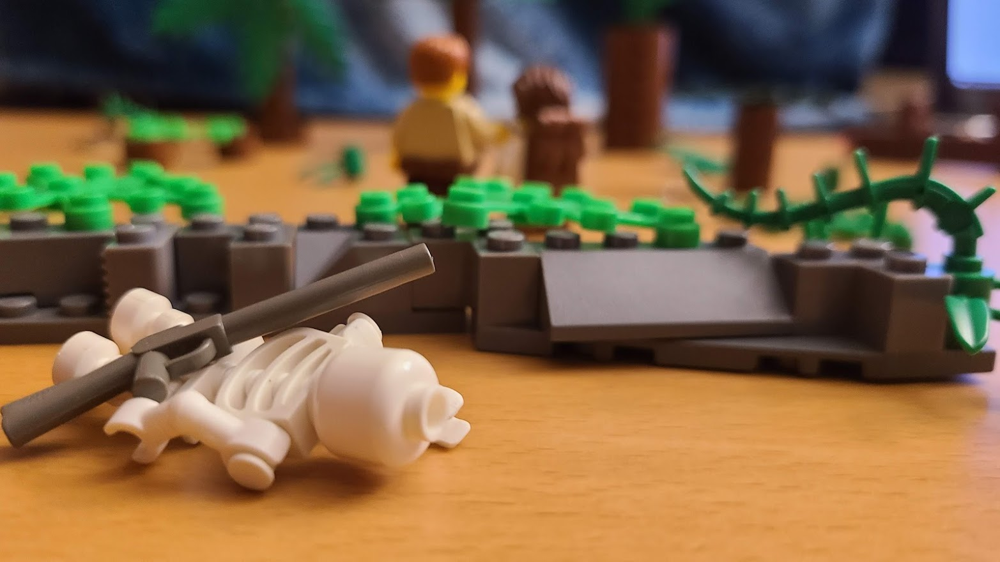
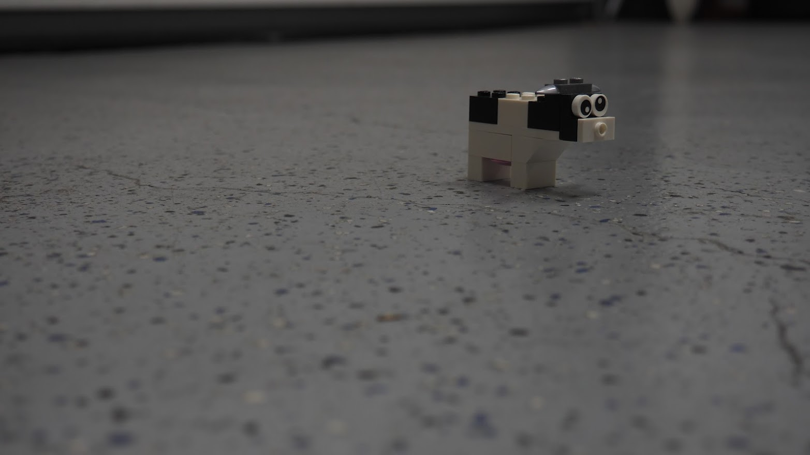
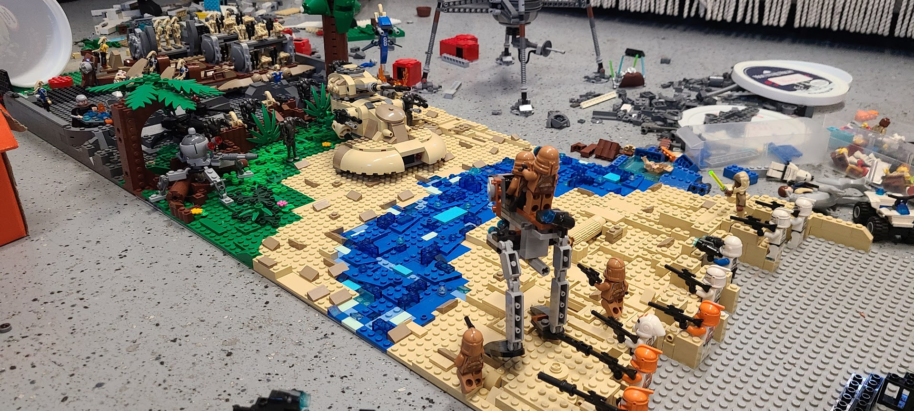
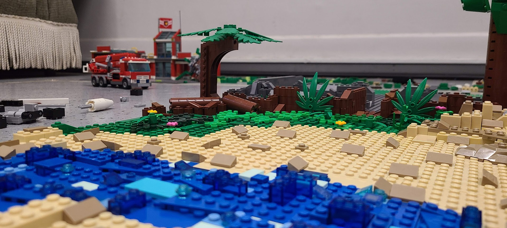
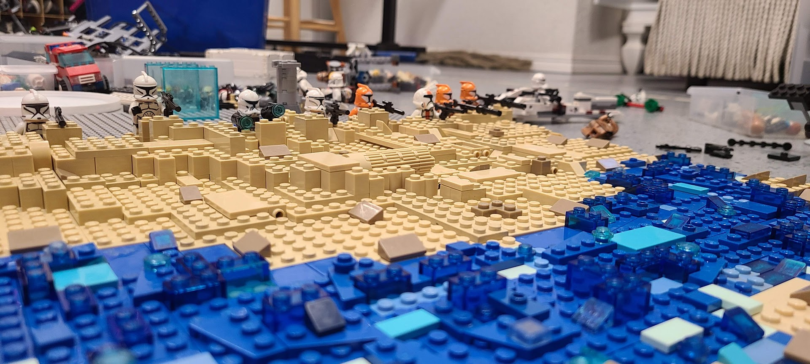
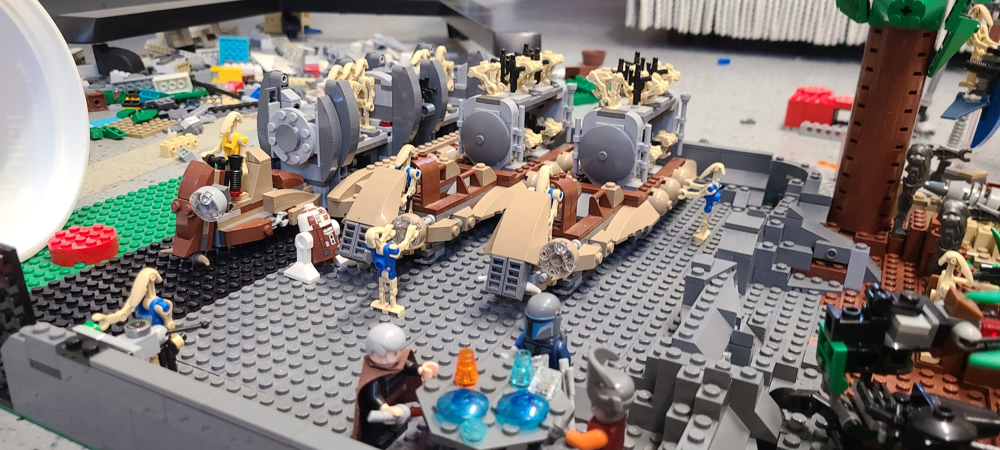
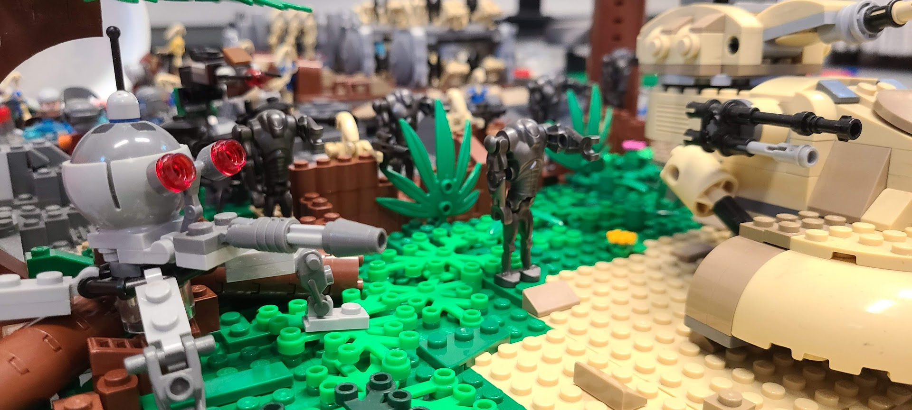
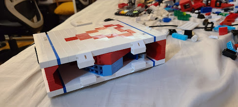
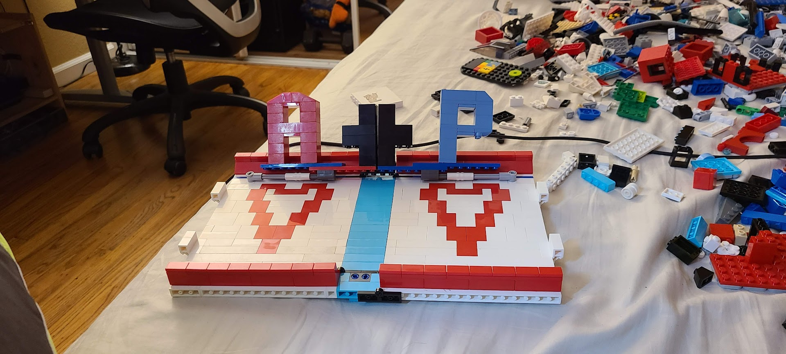

# **Interests** 😋

I love a lot of different things! Here's a random dump... 

> Last modifed in early 2021... much-needed updates coming soon!  

## **Stuff I Like** 🤗

* Disney Movies (Tangled, Enchanted, Star Wars, PoTC, Marvel, etc. 🥰)

??? tip "My AP Euro Term Paper on how Beauty and the Beast inspired the French Revolution"

    Fun fact, in the original, Belle and the Prince are cousins and that's why they get married! Plus, Belle's part-fairy.

    

    <iframe width="100%" height="425px" src=../assets/APEuro_Disney_FrenchRev.pdf></iframe>
    

* Legos (especially Star Wars, Disney, and Technic)

??? note "Some of my recent creations (for fun, for class)"

    >*Recently, my friend and I tried creating some Lego NFTs for fun. Check out [Lawless Legos](https://opensea.io/collection/lawless-legos) (hyperlinked) here!*

    &nbsp; &nbsp;

    These first few were for Capstone Spanish, re-creating stories we had read in claass.

    1) ***Mar Adentro*** (Sea Inside, following Ramón Sampedro who seeks assisted suicide)

    

    2) ***El Hijo*** (The Son, following a father who refuses to believe his son has died)

    

    **All of the story scenes that were recreated can be found at the following [Google Slides link](https://docs.google.com/presentation/d/1JJH83wJptSJrheQw9ofi7cAmyXyixHGRdeyTfrbfBCk/edit?usp=sharing).**

    &nbsp; &nbsp;

    Additionally, I love to build around, including some of these random creations:

    1) ***The Lonely Cow***

    

    2) ***Star Wars MOC (My Own Creation)***

    
    
    
    
                        

    3) ***Attempt at a pop-up book***

    { width=100% }
         

* Music (anything except classical ngl...)

??? danger "A Playlist I'm Proud Of (Numbers)"

    <iframe src="https://open.spotify.com/embed/playlist/2PZOqGAACBNBALl0uGNRbw?utm_source=generator" width="100%" height="380" frameBorder="0" allowfullscreen="" allow="autoplay; clipboard-write; encrypted-media; fullscreen; picture-in-picture"></iframe>

* Basketball (Played NJB, middle school, and high school teams)

&nbsp; &nbsp;

## **Random Presentations** 🤨

These are some presentations that I made throughout high school...

- [**Economics of Being Hot** (also made and presented for AP Econ)](https://docs.google.com/presentation/d/18IoC_Ghb7EAl4SHkCziQvaRArrS79qtv-2Fjz94pnBM/edit?usp=sharing)
- [**Economics of Breaking Up** (made and presented for AP Econ)](https://docs.google.com/presentation/d/16JfK4IcMdppqO2-oMIjFaWXTw17pnJuC-8t_xj_DRK8/edit?usp=sharing)
- [**StarWars pptx animation** (if you click really fast it looks cool)](https://docs.google.com/presentation/d/1RKZ6oIrujehvXTXSXk9JxTy0Wndmv39Vyy3QitnyXHQ/edit?usp=sharing)

&nbsp; &nbsp;
